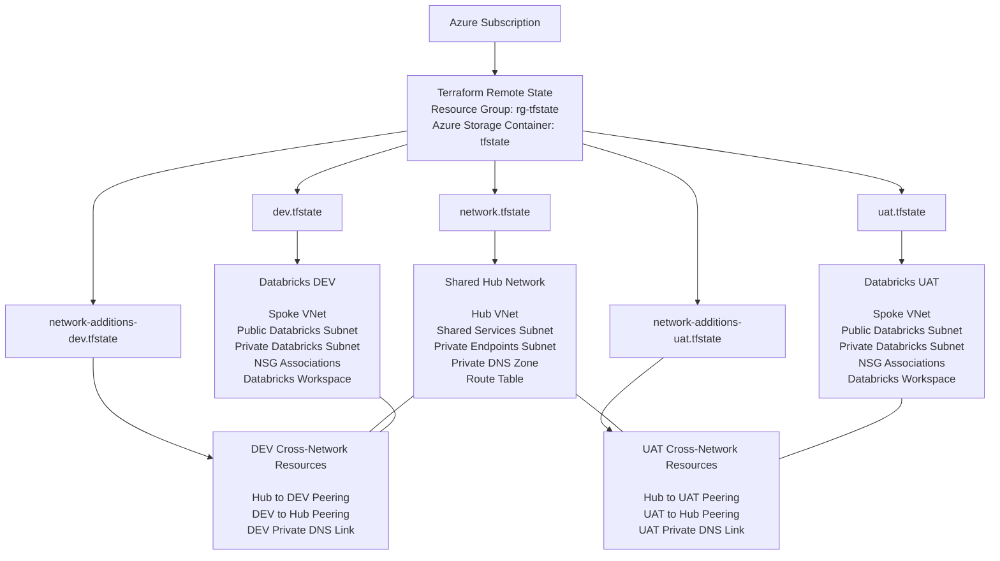

# Azure Databricks Infrastructure POC

## Overview

This repository is a proof of concept for deploying and managing Azure Databricks infrastructure using Terraform and GitHub Actions.

The project is designed to demonstrate enterprise-style Infrastructure as Code patterns while keeping Azure resources disposable and inexpensive to operate.

## Goals

* Learn enterprise Terraform patterns
* Build a reusable Azure Databricks deployment framework
* Implement Infrastructure as Code using reusable Terraform modules
* Implement CI/CD using GitHub Actions
* Explore Azure hub-and-spoke networking
* Configure Azure Databricks VNet injection
* Explore Private Link and Private DNS
* Maintain independent Terraform state files
* Keep test infrastructure disposable to minimize Azure costs

## Current Architecture



## Repository Structure

```text
Databricks-Infra/
├── .github/
│   └── workflows/
│       ├── reusable-terraform.yml
│       ├── deploy-hub.yml
│       └── deploy-databricks.yml
│
├── modules/
│   ├── tags/
│   ├── hub_network/
│   ├── databricks_spoke_network/
│   └── databricks_workspace/
│
├── network/
│   ├── backend.hcl
│   ├── main.tf
│   ├── outputs.tf
│   └── providers.tf
│
├── databricks/
│   ├── dev/
│   │   ├── backend.hcl
│   │   ├── main.tf
│   │   ├── outputs.tf
│   │   └── providers.tf
│   │
│   ├── uat/
│   │   ├── backend.hcl
│   │   ├── main.tf
│   │   ├── outputs.tf
│   │   └── providers.tf
│   │
│   └── prd/
│
└── network-additions/
    ├── dev/
    │   ├── backend.hcl
    │   ├── main.tf
    │   ├── outputs.tf
    │   └── providers.tf
    │
    └── uat/
        ├── backend.hcl
        ├── main.tf
        ├── outputs.tf
        └── providers.tf
```

## Terraform Modules

### `tags`

Provides standardized tags for Azure resources.

Example tags include:

* Environment
* Owner
* Project
* Managed by Terraform
* Cost-control designation

### `hub_network`

Creates shared network infrastructure, including:

* Hub virtual network
* Shared-services subnet
* Private-endpoints subnet
* Azure Databricks Private DNS zone
* Private DNS link to the hub VNet
* Shared-services route table

Planned additions include:

* Azure Firewall
* Azure Bastion
* Additional route tables
* Centralized outbound traffic routing

### `databricks_spoke_network`

Creates environment-specific Databricks networking resources, including:

* Resource group
* Spoke virtual network
* Databricks public subnet
* Databricks private subnet
* Network security group
* Subnet delegations
* Subnet and NSG associations

The Databricks public and private subnets are both dedicated to the Azure Databricks workspace. The public subnet name does not necessarily mean that resources receive public IP addresses.

### `databricks_workspace`

Creates and configures an Azure Databricks workspace, including:

* Premium Azure Databricks workspace
* Managed resource group
* VNet injection
* Public and private subnet association
* No-public-IP workspace configuration
* Standardized resource tags

## Deployment Strategy

Each infrastructure layer is managed as an independent Terraform root module with its own remote state file.

| Root module             | Purpose                            | State file                      |
| ----------------------- | ---------------------------------- | ------------------------------- |
| `network`               | Shared hub networking resources    | `network.tfstate`               |
| `databricks/dev`        | Development Databricks environment | `dev.tfstate`                   |
| `network-additions/dev` | DEV peering and Private DNS link   | `network-additions-dev.tfstate` |
| `databricks/uat`        | UAT Databricks environment         | `uat.tfstate`                   |
| `network-additions/uat` | UAT peering and Private DNS link   | `network-additions-uat.tfstate` |
| `databricks/prd`        | Future production environment      | `prd.tfstate`                   |

Separating the state files reduces the blast radius of changes and allows infrastructure layers to be deployed independently.

## Deployment Order

Resources must be created in dependency order.

```text
1. network
2. databricks/dev
3. network-additions/dev
4. databricks/uat
5. network-additions/uat
```

Resources should be destroyed in reverse order.

```text
1. network-additions/uat
2. databricks/uat
3. network-additions/dev
4. databricks/dev
5. network
```

Cross-network resources must be destroyed before their parent VNets and Private DNS zones. Otherwise, Azure may prevent deletion because nested VNet links or peering resources still exist.

## CI/CD with GitHub Actions

GitHub Actions is used to validate, plan, and deploy Terraform infrastructure.

The intended workflow includes:

* Terraform formatting checks
* Terraform initialization
* Terraform validation
* Terraform plans
* Terraform applies
* Azure authentication using OpenID Connect
* Separate GitHub environments for DEV, UAT, PRD, and the hub
* Manual environment approvals
* Branch-based deployment controls
* Reusable Terraform workflows

### Branch Strategy

The current deployment model is:

* Merges to `development` deploy DEV
* UAT deployment follows DEV and can require manual approval
* Merges to `main` deploy production infrastructure
* Shared hub infrastructure is managed by a separate workflow

### GitHub Environments

The repository uses GitHub Environments such as:

```text
hub
dev
uat
prd
```

These environments support:

* Required reviewers
* Deployment protection rules
* Environment-specific variables
* Environment-specific secrets
* Azure OIDC federated identity subjects

Example Azure federated identity subject:

```text
repo:crtaylor1997/Databricks-Infra:environment:uat
```

## Cost Management

This project is designed to be disposable.

Infrastructure is deployed for testing and destroyed when it is no longer needed.

### Permanent Resources

The following resources remain deployed:

* Terraform backend resource group
* Terraform state storage account
* Terraform state container

### Temporary Resources

The following resources may be destroyed after testing:

* Azure Databricks workspaces
* Databricks managed resource groups
* Hub and spoke VNets
* Databricks subnets
* Network security groups
* Route tables
* VNet peerings
* Private DNS VNet links
* Private endpoints
* Databricks compute resources

## Completed

* Terraform remote state in Azure Storage
* Standardized resource tagging
* Shared hub VNet
* Shared-services subnet
* Private-endpoints subnet
* Shared-services route table
* Azure Databricks Private DNS zone
* Databricks DEV spoke VNet
* Databricks DEV workspace
* Hub-to-DEV VNet peering
* DEV-to-hub VNet peering
* Private DNS link to the DEV spoke
* Databricks UAT spoke VNet
* Databricks UAT workspace
* Hub-to-UAT VNet peering
* UAT-to-hub VNet peering
* Private DNS link to the UAT spoke
* Independent Terraform state files
* Azure OIDC configuration for GitHub Actions
* Reusable GitHub Actions Terraform workflow
* DEV and UAT deployment workflow structure

## Next Steps

* Complete GitHub Actions validation and plan workflows
* Add approval protection to the UAT GitHub Environment
* Add production Databricks and networking roots
* Refactor remaining workspace configuration into the reusable workspace module
* Add Azure Firewall or NAT Gateway outbound routing
* Add spoke route tables
* Implement Private Endpoint architecture
* Integrate Azure Key Vault
* Configure the Databricks Terraform provider
* Implement Unity Catalog
* Add Databricks cluster policies
* Add Databricks Asset Bundles
* Add notebook CI/CD
* Add job deployment
* Add compute configuration CI/CD
* Add monitoring and diagnostic settings

## Future Architecture Enhancements

Planned enhancements include:

* Production Databricks environment
* Azure Firewall
* Centralized outbound traffic routing
* User-defined routes
* Private Link
* Private Databricks workspace access
* Azure Key Vault integration
* Unity Catalog
* Cluster policies
* Databricks Asset Bundles
* Notebook deployment pipelines
* Databricks job deployment
* Centralized monitoring and logging
